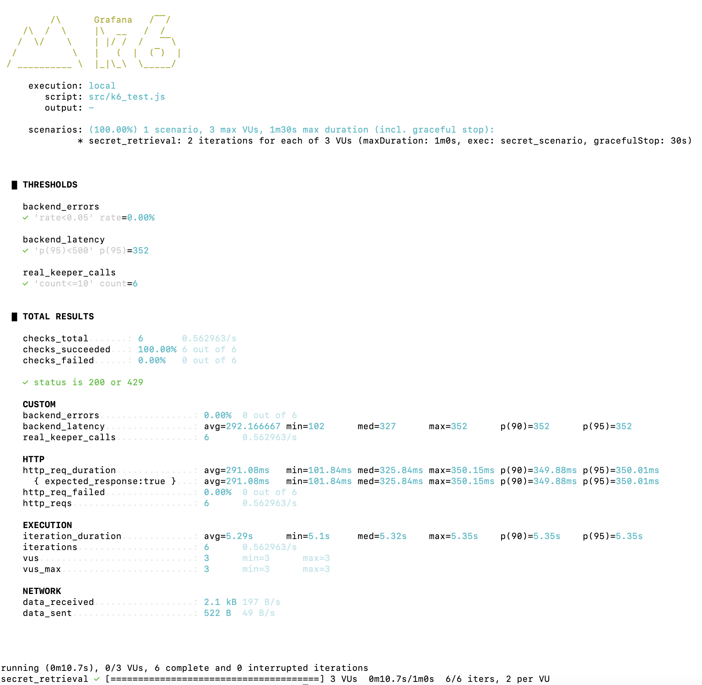

# k6 Test using Keeper SDK

This repository demonstrates a safe and controlled performance test of the **Keeper Secrets Manager JavaScript SDK** using a Node.js API backend and k6 for load generation.


## Table of Contents

- [Overview](#overview)
- [1. Setup](#1-setup)
- [2. First-Time Keeper Authentication](#2-first-time-keeper-authentication)
- [3. Start the Backend (Required Every Run)](#3-start-the-backend-required-every-run)
- [4. Run the k6 Performance Test](#4-run-the-k6-performance-test)

---


## Overview


### Project Structure

**Backend**
- `server.js` – Express/Node HTTP API with in-memory **10-call hard cap**.
- `keeper_client.js` – Keeper SDK wrapper
- `test_keeper_client.js` – First-time connectivity / config initializer.
- `package.json`, `package-lock.json` – Node dependencies.

**k6**
- `src/k6_test.js` – Main load test  

**Security Config**
- `.gitignore` – Ensures logs, results are not tracked by git. Protects secrets.
- `ksm-config.json` – Local Keeper config (created at runtime, never committed).

### Flow

```text
k6 (load & control)
   |
   |  HTTP (k6/http)
   v
Node backend (Express / Node HTTP)
   |
   |  Keeper JS SDK
   v
Keeper Secrets Manager
```

1. **k6** sends HTTP requests to the local backend.
2. **Node.js backend** exposes `/keeper/get-secret` and enforces the 10-call limit.
3. Backend uses **Keeper JS SDK** to fetch a secret by **Record UID**.
4. After 10 real calls, backend returns **429 Too Many Requests** and stops calling Keeper.

Transaction being measured is:

> **`Keeper:getSecretByUid` via `/keeper/get-secret`**

---


## 1. Setup 

Prerequisites
- Node.js & k6
- A Keeper Secrets Manager trial/account

**Install Tools**

```bash
brew install node
brew install k6
node -v
npm -v
k6 version
```

Clone & Install
```bash
git clone https://github.com/shaleensharma05/keeper-k6-perf-challenge.git
cd keeper-k6-perf-challenge

npm install
```

This creates the local node_modules/ folder.

**Setup Keeper Trial + App + Device + Record UID**

- Create a Keeper trial account
- Go to Secrets Manager
- Create (or use) a [Secret Manger Application](https://docs.keeper.io/en/keeperpam/privileged-access-manager/getting-started/applications)
- Add a [Device] and obtain OTAT (https://docs.keeper.io/en/keeperpam/privileged-access-manager/getting-started/devices)
- Copy One-Time Access Token (OTAT), Keeper Hostname (e.g. keepersecurity.com)
- Create a secret record, Copy the Record UID


## 2. First-Time Keeper Authentication
This step creates ksm-config.json so future runs don’t need the OTAT (recommended once per machine)

```bash
export KEEPER_ONE_TIME_TOKEN="YOUR_TOKEN"
export KEEPER_HOSTNAME="YOUR_HOST"
export KEEPER_SECRET_UID="YOUR_RECORD_UID"

node test_keeper_client.js
```

Expected: A ✅ success message from test_keeper_client.js

A new ksm-config.json file in the repo folder

```arduino
ksm-config.json
```
Now unset the one-time token:

```bash
unset KEEPER_ONE_TIME_TOKEN
```
From this point forward, authentication uses only ksm-config.json.

---


## 3. Start the Backend (Required Every Run)

Next, choose a record UID of a secret you created earlier to retrieve and export :
```bash
export KEEPER_SECRET_UID="YOUR_RECORD_UID"

node server.js
```
Server runs at:
```arduino
http://localhost:3000
```

**Sanity Check (optional)**
In another terminal 
```bash
curl http://localhost:3000/keeper/get-secret

or

for i in {1..11}; do curl -i http://localhost:3000/keeper/get-secret; done
```
First 10 requests → 200 OK
After 10 → 429 Too Many Requests

Restart backend node server.js, if sanity check done.

---


## 4. Run the k6 Performance Test

In another terminal, set BACKEND_URL (if needed) and run k6:
```bash
export BACKEND_URL="http://localhost:3000"
k6 run src/k6_test.js
```


**Load Model**
```text
From src/k6_test.js: Executor: per-vu-iterations
Virtual Users: 3
Iterations per VU: 2
Pacing: each VU waits 5 seconds between iterations
Max Duration: 60s

* Scenario:
  - Uses the per-vu-iterations executor.
  - Spawns a small number of virtual users (VUs), each performing several iterations against /keeper/get-secret.

* Metrics:
  - backend_latency (Trend): Measured latency from the k6 perspective.
  - backend_errors (Rate): Fraction of iterations where the response is not a successful backend call.
  - real_keeper_calls (Counter): Counts calls where the backend reports fromCache === false and ok === true.

* Thresholds:
  - backend_latency: 95th percentile under 500 ms.
  - backend_errors: Error rate under 5%.
  - real_keeper_calls: Total count must be ≤ 10.
```


**Dual Safety Design (Node + k6)**

How the Request Limit Simulation Works

```text
* Node.js Hard Cap (Authoritative)
In-memory counter in server.js: After 10 real Keeper calls → always returns HTTP 429

* k6 Hard Cap (Assertion)
In k6_test.js: real_keeper_calls: ['count<=10']
If the backend ever exceeds 10 real calls, the k6 test fails automatically.
```


**Sample Output**




